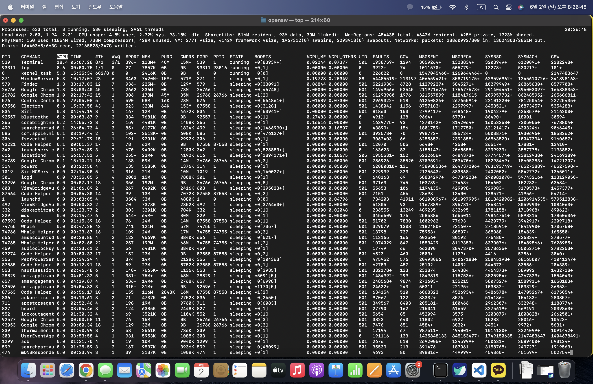
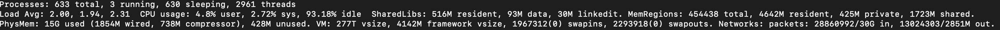
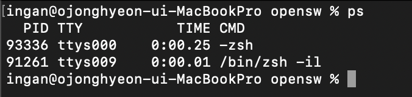
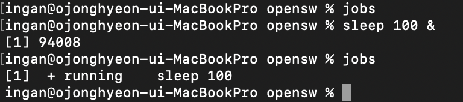
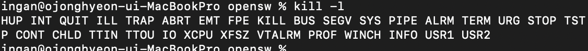

# 리눅스 명령어 top ps jobs kill 조사

- top
  - 개요
  - top명령어
  - 추가 명령어
- ps
  - 개요
  - ps명령어 출력항목
  - ps명령어 옵션
- jobs
  - 개요
  - jobs 명령어 기본 사용법
  - job명령어 옵션
- kill
  - 시그널
  - 시그널의 종류
  - 시그널 목록
  - kill명령어
  - killall명령어

## top

top 명령어를 사용하면 리눅스 계열 서버의 OS상태를 확인 할 수 있다.

top 명령어를 통해 CPU사용량,메모리 사용량등을 확인 할 수 있으며, 서버에서 구동중인 모든 어플리케이션의 사용률이 많은 순서대로 나열하여 모니터링이 가능하다.

**top명령어 사용모습**

현재 제작자의 OS는 mac이라 Linux의 명령어와는 약간 다른 모습을 보여주지만 리눅스에서은 시스템의 시간, OS가 살아있는 시간, 그리고 유저 세션 수도 보여준다.

그리고 2번째줄에선 현재 프로세스들의 상태를 보여주며, CPU와 메모리 사용량도 알 수있다.

**top명령어 3개줄**

다음은 추가 명령어 별 설명이다.

|명령어|설명|
|:---:|:----------------:|
|1|CPU코어 별 사용 현황|
|m|메모리 사용률 시각화 표시|
|shift + p| CPU사용률이 높은 프로세스를 기준으로 나열|
|shift + m| 메모리사용률이 높은 프로세스를 기준으로 나열|
|shift + t| 수행시간이 긴 프로세르를 기준으로 나열|
|k|kill할 프로세스 PID를 입력할 수 있음|
|H|상단의 Tasks 기준을 쓰레드로 변경|
|u|모니터링 할 user을 선택하여,해당 권한 프로세스 감시|

### ps

ps 명령어는 Process State의 약자로 현재 실행중인 프로세스와 상태를 출력하는 명령어 입니다.

**ps명령어 사용모습**

**ps명령어 출력 항목**
|명령어|설명|
|:---:|:---:|
|USER(BSD)|프로세스 소유자의 이름|
|PID|프로세스의 식별번호|
|PPID|부모 프로세스의 PID|
|%CPU|CPU사용 비율의 추정치(BSD)|
|%MEM|Memory 사용 비율의 추정치(BSD)|
|VSZ|K단위 또는 페이지 단위의 가상 메모리 사용량|
|RSS|실제 메모리 사용량|
|TTY|프로세스와 연결된 터미널|
|S(System V)STAT(BSD)|현재 프로세스의 상태 코드|
|TIME|총 CPU사용 시간|
|COMMAND|프로세스의 실행 명령행|
|STIME|프로세스가 시작된 시간 혹은 날짜|
|C(System V)CP(BSD)|짧은 기간 동안의 CPU사용률|
|F|플래그|
|PRI|실제 실행 우선순위|
|NI|nice우선순위 번호|

**ps 명령어 옵션**

|명령어|설명|
|:---:|:---:|
|-A|모든 프로세스를 출력|
|a(BSD)|터미널과 연관된 프로세스를 출력, x옵션과 같이 사용하여 모든 프로세스를 출력할 떄 사용|
|-a|세션 리더를 제외하고 데몬 프로세스처럼 터미널에 종속되지 않은 모든 프로세스를 출력|
|-e|커널 프로세스를 제외한 모든 프로세스를 출력|
|-f|출력을 풀 포맷으로 표기(유닉스 스타일)UID, PID,PPID등이 함꼐 표시|
|-l(System V) l(BSD)|출력을 긴 포맷으로 표기 프로세스의 정보를 길게 보여주는 옵션으로 우선순위와 관련된 PRI값과 NI값을 확인|
|-o|출력 포맷을 지정|
|-M|64비트 프로세스들을 출력|
|-m|프로세스뿐만 아니라 커널스레드도 출력|
|-p|특정 PID를 지정하여 출력|
|-r|현재 실행중인 프로세스 출력|
|u(BSD)|프로세스 소유자를 기준으로 출력|
|-u[사용자]|특정 사용자의 프로세스 정보를 출력,사용자를 지정하지 않는다면 현재 사용자 기준으로 출력|
|x(BSD)|데몬 프로세스처럼 터미널에 종속되지 않은 프로세스를 출력|
|-x|로그인 상태에 있는 동안 아직 완료되지 않은 프로세스를 출력|

#### jobs
jobs를 이용하여 셸에서 실행중인 프로세스 목록을 확인할 수 있습니다.

jobs 명령어의 기본 형식은 다음과 같습니다

jobs [OPTIONS] [JOB]

**jobs명령어 실행모습**
그냥 jobs명령어만 사용하면 실행중인 프로세스가 없기에 sleep으로 백그라운드에 프로세스를 실행 해 봤습니다.

각 항몽이 의미 하는 바는 다음과 같습니다.

- [1]+
첫 번쨰 열의 대괄호 안의 숫자는 잡 ID가 됩니다. 이 번호는 현재 셸에서 유효합니다. 또한 그 다음에 있는 +는 bg나 fg명령 실행 시 기본 인자로 사용된다는 의미입니다. -는 +로 표시된 프로세스가 종료 시 기본값으로 사용될 프로세스를 의미합니다.
- Running
두번째 열은 프로세스의 상태를 나타냅니다. 현재는 Running으로 실행중인 상태를 의미합니다.
- sleep 100 &
  프로세스를 실행한 명령어를 나타냅니다.

**jobs 명령어 옵션**
|명령어|설명|
|:---:|:---:|
|-l|프로세스 ID와 함께 job 목록을 출력합니다.|
|-n|마지막 알림 이후 변경된 job만 출력합니다.|
|-p|job의 프로세스 ID만 출력합니다.|
|-r|실행 중인 job만 출력합니다.|
|-s|중지된 job만 출력합니다.|

##### kill
kill은 단순한 종료 명령어가 아니라 프로세스에 지정된 Signal을 보내는 명령어 입니다. 해당 시그널의 액션이 종료라면 프로세스가 종료하게 되는 것입니다.  
 killall 명령어는 kill명령어와 유사하지만 프로세스 지정을 프로세스 이름으로 합니다.(kill 명령어는 프로세스 번호로 프로세스를 지정)

kill, killall 명령어를 사용하기 위해서는 시그널을 알 필요가 있습니다.
시그널은 유닉스, 유닉스 계열, POSIX 호환 운영 체제에 쓰이는 프로세스 간 통신입니다. 시그널은 여러 종류가 있으며 각각의 시그널은 다른 의미를 가지고 사용됩니다.

**시그널을 발생시키는 이벤트**

1.Hardware Exception

2.Software Condition

3.사용자의 입력

4.kill명령어와 같은 시스템 콜

**시그널의 종류**
|번호|시그널 이름|설명|기본동작|
|:---:|:---:|:---:|:---:|
|1|SIGHUP|연결 끊기(프로세스의 설정 파일을 다시 읽는데 사용) 실행 종료(로그아웃 하거나 접속을 끊을 떄 사용)|종료|
|2|SIGINT|인터럽트, 실행종료(Ctrl + C)|종료|
|3|SIGQUIT|Quit, 실행종료(Ctrl + \)|종료|
|4|SIGILL|잘못된 명령| |
|5|SIGTRAP|trace,breakpoint에서 TRAP발생| |
|6|SIGIOT|IOT 명령| |
|7|SIGBUS|버스 에러| |
|8|SIGFPE|부동 소수점 에러|종료|
|9|SIGKILL|무조건적으로 즉시 중지(이 시그널은 잡거나 무시되지않음)|종료|
|10|SIGUSR1|사용자 정의 시그널 1|종료|
|11|SIGSEGV|Segmentation위반, 허가되지 않은 메모리 영역 접근| |
|12|SIGUSR2|사용자 정의 시그널 2|종료|
|13|SIGPIPE|읽을 것이 없는 파이프에 대한 시그널|종료|
|14|SIGALRM|경보 시그널|종료|
|15|SIGTERM|소프트웨어 종료 시그널(잡히는 시그널이기 때문에 트랙 가능)|종료|
|16|SIGTKFLT|코프로세서 스택 실패| |
|17|SIGCHLD|프로세스 종료 시 그 부모 프로세스에게 보내지는 시그널|무시|
|18|SIGCONT|Continue(STOP이나 TSTP시그널에 의해 정지된 프로세스를 다시 계속해서 실행)| |
|19|SIGSTIOP|정지 시그널(TSTP와 같으나 잡거나 무시할 수 없음, 무조건적으로 정지)|프로세스 정지|
|20|SIGTSTP|실행을 정지 후 다시 실행을 계속하기 위하여 대기(Ctrl + z)|프로세스 정지|

**시그널 목록**

**kill 명령어 및 옵션**
kill 명령어
|명령어|옵션|
|:---:|:---:|
|kill [옵션 or 시그널][프로세스 번호]|해당 프로세스를 종료    kill -s [시그널 번호 or 이름]을 사용하거나   kill -[시그널 번호 or 이름]도 사용이 가능|

kill 명령어 옵션
|명령어|옵션|
|:---:|:---:|
|-s[시그널 번호 or 이름]   -[시그널 번호 or 이름]|보낼 시그널을 지정
|-l|시그널 목록을 출력|

**killall 명령어 옵션**

|옵션|설명|
|:---:|:---:|
|-e|매우 긴 이름에 대해 정확한 일치를 요구(15글자가 넘을 경우 이용 불가능 할 수 있음)|
|-g|프로세스가 속한 프로세스 그룹을 종료|
|-i|종료전에 확인 요구|
|-l|시그널 목록을 출력|
|-q|프로세스가 죽지 않아도 컴플레인을 출력하지 않음|
|-s[시그널 번호 or 이름]|SIGTERM 대신 지정한 시그널을 프로세스에게 전송  시그널 이름은 대문자로 지정|
|-v|시그널이 성공적으로 보내졌다면 보고|
|-V|버전 정보를 출력|
|-w|프로세스가 종료될 때까지 대기  (시그널이 무시되거나 영향이 없을 경우, 프로세스가 좀비 상태에 머무른다면 영원히 기다리게 될 수도 있음)|
